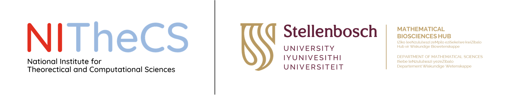

# The National Institute for Theoretical and Computational Sciences ([NITheCS](https://nithecs.ac.za/))

## <u>E</u>cological <u>Co</u>mplexity and <u>Bi</u>odiversity ([ECoBi](https://nithecs.ac.za/modelling-biodiversity/))
ECoBi is a work package within the Complexity in Biological Systems (E5) research programme focussed on Unravelling complexity in coupled **E**arth, **E**nvironmental, **E**cological, **E**volutionary and **E**conomic systems.
We investigate how biodiversity patterns and ecological processes emerge, interact, and evolve across spatial, temporal, and organizational scales. Concurrently, we develop quantitative frameworks and open-source tools to enable rigorous monitoring and analysis of biodiversity under global change.
ECoBi is structured around five core objectives:

1.  **Biodiversity Entropy and Symmetry Across Scales**: Develop a unified theoretical framework to harmonise biodiversity metrics across scales, reducing bias and exploring eco-evolutionary processes through the lens of entropy and symmetry.
2.  **Structural Emergence in Complex Adaptive Networks**: Investigate the stability, resilience, and emergent properties of adaptive ecological networks, from microbiomes to food webs, in response to both internal dynamics and external environmental shifts.
3.  **Biodiversity Dynamics in Protected Landscapes**: Quantify, model, and map biodiversity - from genes to ecosystems - across protected areas to understand ecological functioning and inform conservation policy and planning.
4.  **Spatiotemporal Dynamics and Adaptive Interactions in Ecosystems**: Model species distributions, biome transitions, and ecological disequilibria under climate change, using biodiversity metrics, movement data, and evolutionary game theory to explore adaptive interactions.
5.  **Innovative Computational Tools for Biodiversity Monitoring**: Develop open, scalable software tools - including a Biodiversity Informatics Hub and smart sensor systems - to support long-term biodiversity monitoring in African landscapes. This also includes building a research network across African protected areas to co-design training and capacity-building tailored to regional conservation needs.

Building on these five objectives, we - the Mathematical Sciences Hub ([BioMath](https://biomath.sun.ac.za/)) at Stellenbosch University - recognise the urgent need for a unified strategy to manage and interpret the deluge of biodiversity data. As pressures from climate change, land‐use transformation, pollution and resource exploitation intensify, BioMath is pioneering innovative approaches to synthesise and analyse large‐scale ecological datasets. In partnership with NITheCS and the [Savanna Research Unit](https://www.sanparks.org/conservation/scientific-services/nodes/savanna-research-unit/overview) of South African National Parks (SANParks), we’re building user‐friendly tools, reproducible workflows and predictive models to consolidate data streams and forecast biodiversity trajectories. This collaborative effort ensures park managers and scientists have the quantitative frameworks and open‐source platforms needed to monitor, halt—and ultimately reverse—biodiversity loss across African landscapes.

[")](https://doi.org/10.1016/j.biocon.2022.109736)
